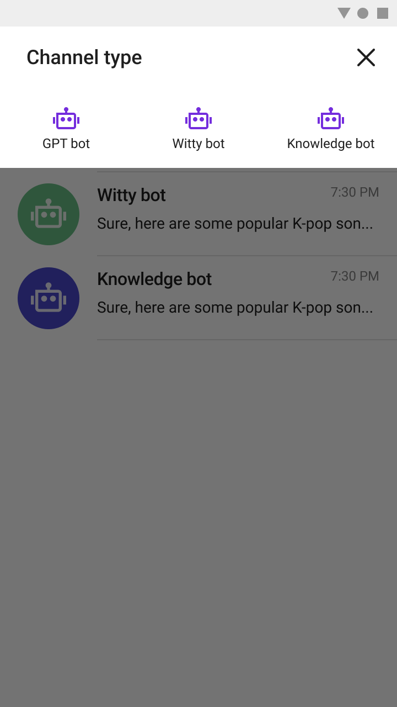
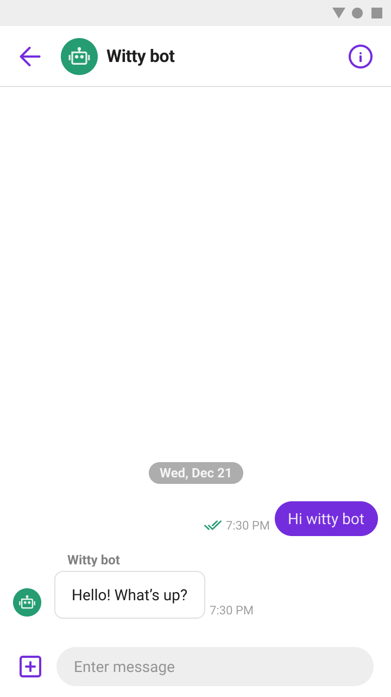

# Sendbird ChatGPT Sample for React-Native

This is an example of [Sendbird ChatGPT Bot](https://sendbird.com/docs/chat/v3/platform-api/bot/bot-overview#1-overview) for React-Native, implemented using [Sendbird UIKit](https://sendbird.com/docs/uikit/v3/react-native/overview).

<p>
Sendbird ChatGPT Bot is a GPT3-powered bot that's built on top of Sendbird's existing bots. It can provide your users with highly engaging and natural conversational experience. It's integrated natively inside Sendbird so that you don't have to worry about developing and deploying OpenAI services separately.

</p>

<p align="center">
  
  
</p>

## Requirements

The minimum requirements for ChatGPT sample for React-Native are:

- Android 5.0 (API level 21) or higher
- Java 11 or higher
- iOS 12.4 or higher
- Sendbird UIKit SDK for React-Native 2.0.0 and later
- Sendbird Chat SDK for JavaScript 4.3.0 and later

## Getting Started

1. Create your Sendbird application on [the dashboard](https://dashboard.sendbird.com/auth/signup).
2. [Register the ChatGPT bot](https://sendbird.com/developer/tutorials/chatgpt-integration-build-a-chatgpt-powered-chatbot-part-1) in your Sendbird application.
3. In this example, we're connected to a test Sendbird application and pre-defined bots. To connect yours, replace `APP_ID`, `Bots` and others in the [`src/configurations.ts`](src/configurations.ts) file as follows:

```ts
// TODO Replace with your own APP_ID
export const APP_ID = 'BDD627AC-AC88-45F4-B277-2B3B5C4610E3';
// TODO Replace with your own USER_ID
export const USER_ID = `User_ReactNative_${Platform.OS}`;
// TODO Replace with your own NICKNAME
export const USER_NAME = USER_ID;

// TODO Replace with your own user ids of bots
export const Bots: Record<string, Bot> = {
  Bot1: {
    id: 'gpt_bot',
    name: 'GPT Bot',
    icon: require('./assets/bot.png'),
  },
  Bot2: {
    id: 'gpt_bot2',
    name: 'Witty Bot',
    icon: require('./assets/bot.png'),
  },
  Bot3: {
    id: 'gpt_bot3',
    name: 'Knowledge Bot',
    icon: require('./assets/bot.png'),
  },
};
```

4. Install the dependencies with `yarn install`.
5. Install the pod dependencies with `npx pod-install`.
6. Run the application with `yarn android` or `yarn ios` scripts.

## How to connect a channel to a bot

This sample supports chat with 3 different bots. They are trained with 3 different characteristics.
Currently, Only 1:1 chat with ChatGPT bot is supported. When you create a channel, you just need to enter the user ID of the bot you want to chat with.

```ts
const startWithChatGPTBot = async (bot: Bot) => {
  hide();

  const channel = await sdk.groupChannel.createChannel({
    name: '',
    coverUrl: '',
    isDistinct: false,
    invitedUserIds: [bot.id, currentUser!.userId],
    operatorUserIds: [currentUser!.userId],
  });

  navigation.navigate(Routes.GroupChannel, { channelUrl: channel.url });
};
```

For more details about code, please see [`src/components/CustomChannelTypeSelector.tsx`](src/components/CustomChannelTypeSelector.tsx#L28-L40)

For more information, see [our documentation](https://sendbird.com/docs/chat/v3/platform-api/bot/bot-overview#1-overview) and [our tutorial](https://sendbird.com/developer/tutorials/chatgpt-integration-build-a-chatgpt-powered-chatbot-part-1).
